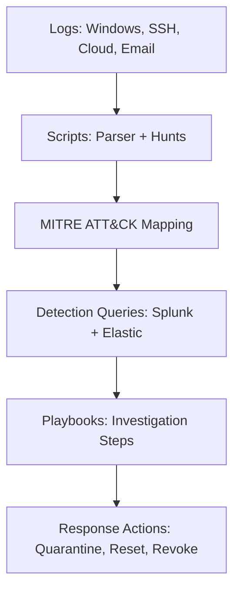

# Threat-Hunting-Toolkit


---

## Overview
Threat-Hunting-Toolkit is a MITRE ATT&CK‑aligned collection of scripts, detection queries, datasets, and playbooks designed for SOC analysts and cybersecurity professionals.  
It demonstrates practical threat hunting workflows across **Windows Event Logs, Linux SSH logs, Splunk SPL, and Elastic KQL**.

---

## 📂 Repository Structure
```text
Threat-Hunting-Toolkit/
├── scripts/              # Automation scripts
│   ├── hunt_parser.py
│   ├── win_event_hunt.ps1
│   └── ssh_hunt.sh
├── queries/              # Detection queries
│   ├── splunk_hunts.spl
│   └── elastic_hunts.kql
├── playbooks/            # Threat hunting playbooks
│   ├── suspicious_logon.md
│   ├── persistence_hunt.md
│   ├── phishing_hunt.md
│   └── cloud_iam_hunt.md
├── datasets/             # Sample datasets
│   ├── sample_events.json
│   └── sample_events_v2.json
├── tests/                # Unit tests
│   └── test_hunt_parser.py
├── README.md
└── LICENSE
```
## ✨ Features
- Cross-platform scripts
- Detection queries
- Playbooks
- Sample datasets
- Unit tests
## 🔄 Workflow
- Collect logs → Windows, SSH, Cloud, Email
- Parse events → Python, PowerShell, Bash scripts
- Map to MITRE ATT&CK techniques
- Run detection queries (Splunk SPL / Elastic KQL)
- Investigate with playbooks
- Respond & document
## 🔮 Future Work
- Add YARA rules for malware hunting
- Expand cloud playbooks (GCP, Kubernetes)
- Integrate CI/CD pipeline for automated hunts
- Add Splunk/Elastic dashboards
## 🛡️ MITRE ATT&CK Coverage
- T1110 – Brute Force
- T1078 – Valid Accounts
- T1059 – Command Execution
- T1547 – Persistence
- T1566 – Phishing
- T1098 – Account Manipulation
- T1087 – Account Discovery

```
## 📂 Textual Diagram (ASCII Box Style)
  +-------------------+        +-------------------+        +-------------------+
|   Log Sources     | -----> |   Hunt Scripts    | -----> | MITRE ATT&CK Map  |
| (Windows, SSH,    |        | (Python, PS, Bash)|        |   Techniques      |
|  Cloud, Email)    |        +-------------------+        +-------------------+
+-------------------+                 |                           |
                                      v                           v
                              +-------------------+        +-------------------+
                              | Detection Queries | -----> |   Playbooks       |
                              | (Splunk, Elastic) |        | Investigation     |
                              +-------------------+        +-------------------+
                                                                |
                                                                v
                                                        +-------------------+
                                                        | Response Actions  |
                                                        | (Quarantine, MFA, |
                                                        |  Reset, Revoke)   |
                                                        +-------------------+
```
## 📦 Architecture Diagram (Mermaid)

## 📌 License
This project is licensed under the MIT License — see the [LICENSE](LICENSE) file for details.
